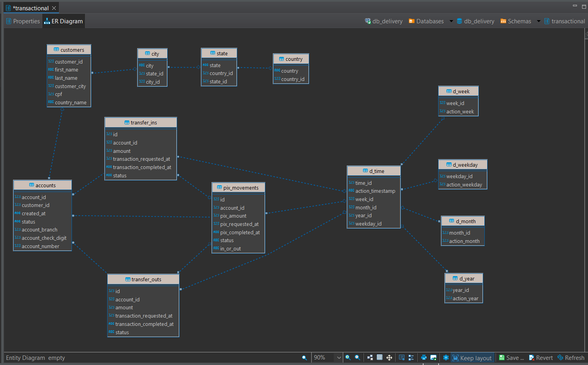
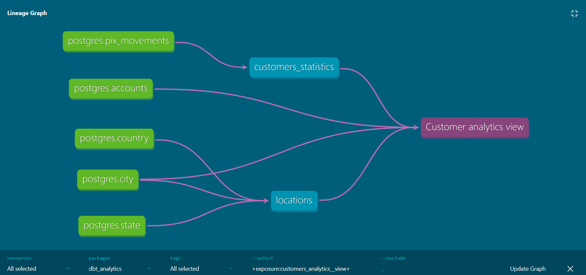

# Customers pix movements DBT Core project

### This is the first project in the DBT core of this repository using a Postgres database, generating views for analytics. The database used is a fictitious database of customer financial movements through Pix transactions.

## Objective

#### The project aims to consolidate knowledge in DBT training and create a data solution from data extraction and modeling to the development of a dashboard in Power BI.

## About data source

#### The set of tables used in this project consists of financial transaction data, customer and account data, information about location and date. This same database is used in DBT courses taught by the Data Engineering Academy of Brazil.
&nbsp;


## Sorces

#### All database tables are used in the DBT project source
&nbsp;
```yml
sources:
  - name: postgres
    database: db_delivery
    schema: transactional
    tables:
      - name: accounts
        tags: ['painel_contas', 'Contas']
      - name: customers
        tags: ['painel_contas', 'Clientes']
      - name: pix_movements
        tags: ['painel_contas', 'Movimentos']
      - name: transfer_ins
        tags: ['painel_contas', 'Entradas']
      - name: transfer_outs
        tags: ['painel_contas', 'Saídas']
      - name: city
        tags: ['localizacao', 'cidades']
      - name: state
        tags: ['localizacao', 'estados']
      - name: country
        tags: ['localizacao', 'países']
      - name: d_time
        tags: ['data']
      - name: d_week
        tags: ['data', 'semana']
      - name: d_weekday
        tags: ['data', 'dia_semana']
      - name: d_month
        tags: ['data', 'mês']
      - name: d_year
        tags: ['data', 'ano']
```

## Models and Exposures

#### A data view is generated from the union of several tables and ephemeral models. This view contains statistical data from customers that will be used as an object of analysis in analytics projects.


#### Example of ephemeral model used in the project:
&nbsp;
~~~~sql
{{
    config(
        materialized='ephemeral'
    )
}}

SELECT _city.city_id,
       _city.city,
       _state.state,
       _country.country
  FROM {{ source('postgres', 'city') }} AS _city
  INNER JOIN {{ source('postgres', 'state') }} AS _state ON _city.state_id = _state.state_id
  INNER JOIN {{ source('postgres', 'country') }} AS _country ON _state.country_id = _country.country_id
~~~~

## Documentation

#### One of the most attractive features of DBT is its documentation that is automatically generated after each project change. Below we see all the data flow created to obtain the view for analytics

&nbsp;
